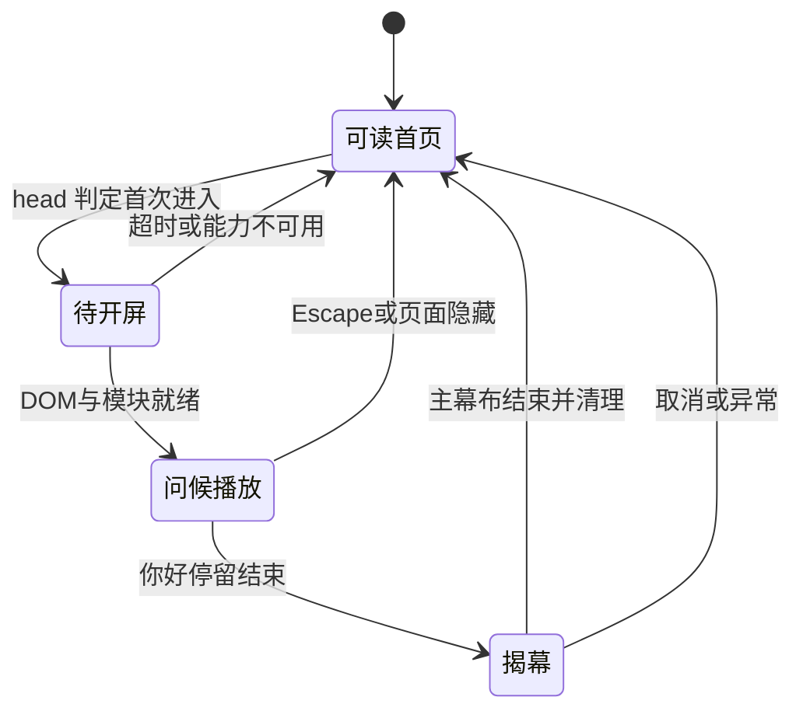

# 实施、验收与版本保存

关联：[开发计划](README.md)、[需求与设计](requirements-and-design.md)、[V1 检查记录](verification-v1.md)、[V2 检查记录](verification-v2.md)。文件方案已落实；V2 只变更刷新播放判定，实际通过项与待验证项以对应检查记录为准。

## 1. 最小改动方案

| 文件 | 计划变更 | 原因 |
|---|---|---|
| index.html | head 加播放判定与独立释放逻辑；body 加开屏 DOM 和同步模态保护；只在首页加载资源 | 提前覆盖首屏并把功能限制在首页 |
| home-intro.css（新增） | 仅含开屏自身选择器、活动状态和移动尺寸规则 | 不修改共享样式，避免影响子页 |
| home-intro.js（新增） | 原生动画、语言序列、统一清理、取消与生命周期处理 | 不把可选开屏异常耦合到现有交互脚本 |
| 本目录与开发日志 | 实际状态、验收结果、保存点与交接 | 每阶段可审阅、可继续 |

content.js 和 script.js 的既有内容渲染、导航初始化顺序保持有效。本轮没有理由修改共享 styles.css、内容数据或游戏产物；若实施中发现直接依赖必须修改，先记录依据和验收影响。

已有首页没有 Hero 自动入场动画，因此不为了复制参考事件系统新增 Hero 动画、重写渲染或引入图形库。黑幕揭开后直接露出原首页。

## 2. 状态与初始化

默认状态是可读首页。head 只在符合条件时激活开屏，独立的 6 秒释放计时器与外部脚本分开；动画模块另设 5 秒恢复计时器。计时器从各自初始化时开始，不能承诺任何浏览器状态下都以访问起点精确计时。

页面结构使用原生 dialog，背景覆盖、弧边和文字单独分层。body 内联启动逻辑在外部脚本下载前打开模态层，提前注册 Escape、隐藏页面、pagehide 和减少动画变化；关闭时拆监听并恢复进入前焦点，使用 preventScroll。

动画模块使用浏览器 Web Animations API，私有 finish 函数取消动画、清理计时器、关闭 dialog、移除活动属性，再通知 head 拆除独立释放逻辑。早期取消或故障触发统一 home-intro-release 事件；head 即可关闭模态层，动画模块若已运行则同步取消。滚动只通过活动属性的 CSS 锁定，不改写原有内联样式。

模块使用私有作用域，避免与共享 script.js 的全局 reducedMotion 等名称冲突。初始化和每次异步等待结束后都检查开屏活动状态及是否已取消；head 超时释放后，迟到模块不得重新显示 dialog 或再次锁滚动。正常结束、取消和超时清理可重复调用，结果应一致。

早期判定只传递播放状态，不重复跑一份完整动画。没有多个脚本争夺同一个滚动状态、重复取消后重新播放或把永久样式写回 body 的行为。模态层关闭前先处理焦点归属；JS 禁用时默认隐藏可选开屏。

## 3. 按步骤实施

1. **检查执行基线** → 验证：读取当前 status，和保存清单比较，保留新的用户改动；记录执行起点，不能假设工作区仍停在规划状态。
2. **制作首页原型** → 验证：完成语言顺序、文字位置和 CSS 弧边；新标签页正常结束；先看效果，不加入整站转场。
3. **补齐行为规则与恢复** → 验证：连续刷新每次播放，锚点直达跳过而刷新带锚点时播放；减少动画、Escape、页面隐藏和脚本失败后释放。
4. **代码审阅与相关回归** → 验证：运行已有语法/空白检查，观察共享功能未受影响；修复确实发现的问题。
5. **桌面和手机视觉验收** → 验证：相同尺寸比较参考和本地，记录结果、截图与用户反馈；只按反馈调整相关参数。
6. **保存交付版本** → 验证：最终 diff、检查记录和本地快照齐全；提交/推送/部署等待明确指令，完成后核对实际 SHA 与发布入口。

每个实现阶段结束保存一次，不按时间间隔反复保存或跑全站检查。新修改、失败或未解决疑点才触发补充验证。

## 4. 验收矩阵

初始状态均为“未执行”；V1 实际结果已写入检查记录。后续检查仍须写明日期、浏览器/视口、操作、结果和证据，不把源码阅读当浏览器通过。

| 编号 | 场景 | 通过标准 | 方法 |
|---|---|---|---|
| A01 | 新标签页首次无 hash 进入 | 固定八种问候与弧形揭幕，结束可操作 | CUA 浏览器与源码参数核对 |
| A02 | 同标签页连续刷新、返回首页 | 刷新每次播放；普通返回不重播，后退前进正常 | CUA 浏览器 |
| A03 | #lab / #about 直接进入及刷新 | 直达跳过；刷新播放，结束仍保留锚点目标 | CUA 浏览器 |
| A04 | ?motion=reduce | 不覆盖内容，不锁滚动 | CUA 浏览器 |
| A05 | 系统减少动画，含播放中切换 | 不播放或立即结束，可访问原内容 | 可用系统或浏览器设置；不可用时标记待检 |
| A06 | Escape、键盘 Tab、取消后重返 | 无焦点陷阱、无背景误操作、无残留状态 | CUA 浏览器 |
| A07 | 首次动画中隐藏页面再回来 | 不重播、不残留黑幕或滚动锁 | 当前浏览器支持的标签页切换操作 |
| A08 | 模块失败、存储不可用、JS 禁用、动画能力不可用 | 页面保持或恢复可读 | 支持的浏览器设置；必要时独立临时副本注入失败，记录限制，不改正式文件 |
| A09 | 320 / 375 / 390 / 430 / 1440px，含一次手机横屏 | 所有问候可见，无换词跳动/横溢出，弧边自然 | 当前 CUA 可用的视口设置与截图 |
| A10 | 首页 Now/Lab/Garden/Side Quests、导航与返回顶部 | 渲染及既有主要操作正常 | 一轮相关功能烟测 |
| A11 | Lab/Garden 索引、一个详情页、游戏入口 | 不加载首页开屏资源，原入口正常 | 相关子页烟测；不重复游戏全面验收 |
| A12 | 网络慢、字体慢、超时后脚本迟到 | 字体等待有上限，开屏独立于其他资源，释放后不得重启 | 可用的浏览器工具或独立临时副本；不可用时注明未模拟 |
| A13 | iPhone/iPad Safari 真机 | 手势、地址栏变化、横竖屏与焦点恢复正常 | 用户设备复测；桌面模拟不能替代 |
| A14 | diff 和脚本 | 无无关改动、无语法或新增控制台错误 | git diff --check；现有可用 Node 的 node --check home-intro.js；浏览器日志 |

没有 npm build、项目类型检查或覆盖率门槛。这些检查标记为“不适用”，不新增工具链凑流程。浏览器操作仅使用当前 CUA 已提供的能力；不写不存在的路由拦截或设备模拟命令。临时副本和证据放独立目录，完成后不把验证脚本加入产品。

## 5. 版本保存与回退

| 保存点 | 需要保存 | 状态 |
|---|---|---|
| V0 规划前 | HEAD 归档、已有未提交补丁/文件、哈希 | 已保存，见 README |
| V1 开屏原型通过 | 本阶段源码、相对执行起点的 diff、效果截图 | 已保存，路径和重建方式见 V1 检查记录 |
| V2 刷新播放调整 | 刷新规则变更、相关检查、源码与快照 | 按用户新要求保存；视觉参数沿用 V1，真机待验证项仍保留 |
| 发布版本 | 授权后的 Git 提交 SHA、推送/部署结果 | 未产生 |

本地快照保存到本会话独立产物目录；源码、diff、截图和清单保持同一保存点，不仅保存屏幕效果。执行前先记录最新基线，避免覆盖规划后用户增加的内容。

若后续需要隔离分支，可使用 codex/multilingual-intro；只创建/使用明确记录的分支，不把“有分支”当作未提交修改的备份。当前规划阶段不切换分支。

回退优先移除本次独立资源引用和对应新增文件，再精确撤销首页本次改动；从 V0 取对应文件时先检查是否包含后续用户修改。先在独立目录验证基线可重建，不用 git reset --hard 或批量清理未跟踪文件。已提交版本需要回退时，按授权使用可审阅的反向修改，保留历史。

git archive 保存的是 HEAD 内容；未提交补丁和未跟踪文件另存。重建基线时应在独立目录解压 tracked-head.zip，先应用 index.patch，再应用 worktree.patch；随后复制 working-files/ 保留原始换行字节，再复制 untracked/。零字节补丁跳过，不直接覆盖当前工作区。ignored 本机依赖没有包含在快照内。

## 6. 完成定义

- [x] 用户同意按首页开屏路线执行，需求规格与 V1 实现一致。
- [x] A01–A12、A14 的本阶段适用检查完成；无法执行项注明具体限制。
- [x] A13 明确作为待真机验证项交接，未宣称真机通过。
- [ ] 用户看过效果并给出视觉结论。
- [ ] V1/V2 快照和最终 diff 已保存，已有日志与无关文件保持完整。
- [x] 没有未经明确指令提交、推送、部署。

P4 可以形成有明确真机待验证项的本地交付；不能据此宣称所有设备验收完成。P5 发布阶段单独记录授权、操作和线上结果。
